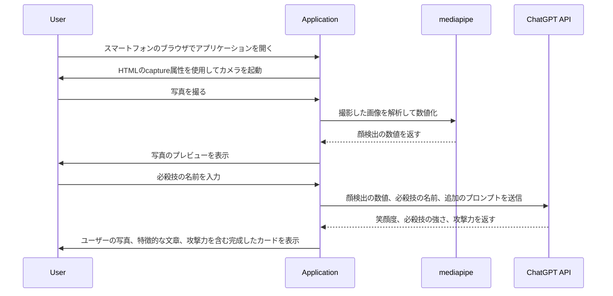

## 最低機能要件のシーケンス図

```mermaid
sequenceDiagram
    User->>Application: スマートフォンのブラウザでアプリケーションを開く
    Application->>User: HTMLのcapture属性を使用してカメラを起動
    User->>Application: 写真を撮る
    Application->>mediapipe: 撮影した画像を解析して数値化
    mediapipe-->>Application: 顔検出の数値を返す
    Application->>User: 写真のプレビューを表示
    User->>Application: 必殺技の名前を入力
    Application->>ChatGPT API: 顔検出の数値、必殺技の名前、追加のプロンプトを送信
    ChatGPT API-->>Application: 笑顔度、必殺技の強さ、攻撃力を返す
    Application->>User: ユーザーの写真、特徴的な文章、攻撃力を含む完成したカードを表示
```
